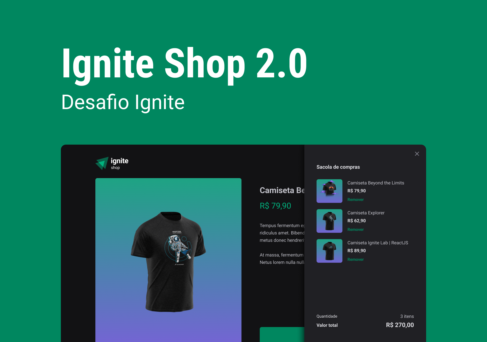

<div align="center">
    
</div>

<p align="center">
  

  

  
  
  <a href="https://github.com/guilhermezaparoli/Github-Blog/commits/master">
    
  </a>
    
   

   <a href="https://github.com/guilhermezaparoli/Ignite-Shop/stargazers">
    
  </a>
</p>

<p>
  
</p>

<h4 align="center">
🚀 Aplicação Finalizada 🚀
</h4>

<p align="center">
 <a href="#-about">About</a> |
 <a href="#-layout">Layout</a> | 
 <a href="#-deploy">Deploy</a> | 
 <a href="#-how-it-works">How It Works</a> | 
 <a href="#-technologies">Technologies</a> | 
 <a href="#-author">Author</a> | 
 <a href="#-license">License</a>
</p>

## 💻 About

O Ignite Shop é um aplicação web de vendas de camisetas com temas do mundo dev, mostrando com detalhes a parte visual e informacional das camisetas, além de apresentar um carrinho onde o cliente pode adicionar as suas compras.

O principal conceito treinado nesta aplicação foi a utilização do framework Next.js, explorando conceitos como o de SSR(Server Side Rendering) e SSG(Static Site Generation), além da utilização da biblioteca Stitches.js para a estilização.

O projeto foi desenvolvido como conclusão de um desafio do curso **Ignite** oferecida pela [Rocketseat](https://www.rocketseat.com.br/). O Ignite é um curso de especialização em stacks específicas amplamente utilizadas e valorizadas no mercado como React, React Native, Node.js e Elixir.

---

## 🎨 Layout

Você pode visualizar o layout do projeto através [desse link](https://www.figma.com/file/FxlDRKOmznBbTH8DsTgnZU/Ignite-Shop-2.0/duplicate). É necessário ter conta no [Figma](https://www.figma.com/) para acessá-lo.

---

## 🔗 Deploy

Para acessar o deploy do Website da aplicação basta clicar no link a seguir: [Link](https://ignite-shop-zeta-henna.vercel.app/)

---

## 🚀 How it works

Este projeto contem somente a parte Frontend Web, precisando somente executar a aplicação em seu Browser(navegador).

### Pré-requisitos

Antes de baixar o projeto você vai precisar ter instalado na sua máquina as seguintes ferramentas:

- [Git](https://git-scm.com)
- [NodeJS](https://nodejs.org/en/)
- [Yarn](https://yarnpkg.com/) ou [NPM](https://www.npmjs.com/)

Além disto é bom ter um editor para trabalhar com o código como [VSCode](https://code.visualstudio.com/)

Precisará também fazer a seguinte configuração para rodar o projeto:

- Criar uma conta e projeto no [Stripe](https://stripe.com/br), e copiar as chaves pública e privada do projeto
- Criar na raiz do projeto o arquivo `.env.local`
- Criar no arquivo `.env.local` as variáveis de ambiente, conforme o exemplo do arquivo `.env.example`
- Colocar nas variáveis de ambiente os respectivos valores, incluindo as chaves copiadas do projeto do STRIPE

Todos cartões de crédito disponíveis para teste (ex: 4242 4242 4242 4242) estão especificados na seguinte [documentação](https://stripe.com/docs/testing#cards) do Stripe

#### 🧭 Rodando a aplicação web (Frontend)

```bash
# Clone este repositório
$ git clone git@github.com:guilhermezaparoli/Ignite-Shop.git

# Vá para a pasta da aplicação Front End
$ cd Ignite-Shop

# Instale as dependências
$ npm install

# Configure as variáveis de ambiente (conforme já explicado anteriormente)

# Execute a aplicação em modo de desenvolvimento
$ npm run dev

# A aplicação será aberta na porta:3000 - acesse http://localhost:3000
```

---

## 🛠 Technologies

As seguintes ferramentas foram usadas na construção do projeto:

#### **Website** ([Next.js](https://nextjs.org/) + [TypeScript](https://www.typescriptlang.org/))

- **[Stitches](https://stitches.dev/)**
- **[Phosphor-Icons](https://phosphoricons.com/)**
- **[React-popup](https://react-popup.elazizi.com/)**
- **[Axios](https://github.com/axios/axios)**
- **[Stripe](https://stripe.com/br)**
- **[Keen-Slider](https://keen-slider.io/)**

> Para mais detalhes das dependências gerais da aplicação veja o arquivo [package.json](./package.json)

---

## ✍ Author


[](https://www.linkedin.com/in/https://www.linkedin.com/in/guilherme-zaparoli-gomes-b979b5179/)

[](mailto:guilhermezapas@gmail.com)

---

## 📝 License

Este projeto esta sobe a licença [MIT](./LICENSE).

Guilherme Zaparoli Gomes 👋🏽 [Entre em contato!](https://www.linkedin.com/in/https://www.linkedin.com/in/guilherme-zaparoli-gomes-b979b5179/)
